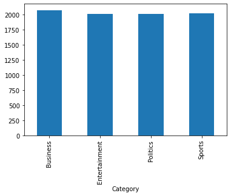

# Automatic Myanmar News Classification

## Project Overview

Automatic Myanmar News Classification System using Multinomial Naive Bayes. I have examined also with other machine learning algorithms - Linear SVM, KNN, Random Forest and Decision Tree. The weighted f-score is highest when using Multinomial Naive Bayes algorithm. THe vecotorizer I used is tf-idf.

## Dataset

Dataset is taken from Aye Hnin Khine's [repository](https://github.com/ayehninnkhine/MyanmarNewsClassificationSystem)


## Experiments

| Model                       | F1-score     |
|:---------------------------:|:------------:|
| K nearest Neighbour         | 62%          |
| Decision Tree               | 64%          |
| Random Forest               | 76%          |
| Linear SVM                  | 77%          |
| **Multinomial Naive Bayes**     | **77%**         |

## Demonstration

Demonstration available [HERE](https://share.streamlit.io/thuraaung1601/automatic-myanmar-news-classification/main/app.py)


## How to ?

- Install requirements
```{r, engine='bash', count_lines}
tra@thura-pc:~$ pip install -r requirements.txt
```
- Run the main notebook - News_Classificaiton.ipynb for training
- For Demo
```{r, engine='bash', count_lines}
tra@thura-pc:~$ streamlit run app.py
```
## Future Works
- More Data is needed to
- Test with Hybrid methods and Deep Learning Approaches

## References 
[1] A.H.Khine, K.T.Nwet, K.M.Soe, Automatic Myanmar News Classification, 15th Proceedings of International Conference on Computer Applications, February 2017, pp. 401-408
<br/>
[2] Nwet, Khin & Darren, Seth. (2019). MACHINE LEARNING ALGORITHMS FOR MYANMAR NEWS CLASSIFICATION. Journal of Natural Language Processing. 8. 17-24. 


