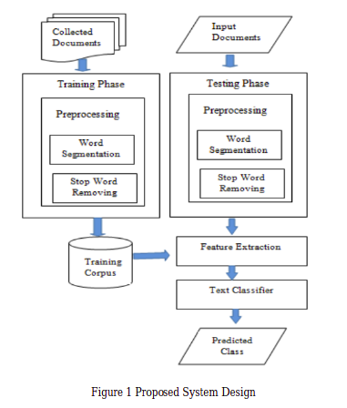

# myNews : Automatic Myanmar News Classification

## Project Overview

Automatic Myanmar News Classification System using Linear SVM. I have examined also with other machine learning algorithms - Logistic Regression, Multinomial Naive Bayes, Random Forest and Decision Tree. The weighted f-score is highest when using Linear SVM.
- A.H.Khine, K.T.Nwet, K.M.Soe, Automatic Myanmar News Classification proposed a system which is based on Naive Bayes. I used their dataset for training the model.[1]
- Tokenzation is done by using pyidaungsu library which is based on fasttext.
- The vecotorizer I used is tf-idf.
- N-gram for TF-IDF is Unigram + Bigram

## System Design

- I use the system design proposed in Nwet, Khin & Darren, Seth, Machine Learning Algorithms for Myanmar News Classification [2] 



## Dataset

Dataset is taken from Aye Hnin Khine's [repository](https://github.com/ayehninnkhine/MyanmarNewsClassificationSystem)


## Experiments

- For feature extraction, vectorize text data using TF-IDF vectorizer available in scikit-learn
- Then train on different machine learning models for classification

| Model                       | F1-score     |
|:---------------------------:|:------------:|
| Decision Tree               | 67%          |
| Random Forest               | 82%          |
| Multinomial Naive Bayes     | 84%          |
| Logistic Regression         | 86%          |
| **Linear SVM**              | **88%**      |

## Demonstration

Demonstration available [HERE](https://share.streamlit.io/thuraaung1601/automatic-myanmar-news-classification/main/app.py)


## How to run demo
- Download this repository
- Install requirements
```{r, engine='bash', count_lines}
tra@thura-pc:~$ pip install -r requirements.txt
```
- Run the main notebook - News_Classificaiton.ipynb for training
- For Demo
```{r, engine='bash', count_lines}
tra@thura-pc:~$ streamlit run app.py
```
## Future Works
- More Data is needed to
- Test with Hybrid methods and Deep Learning Approaches

## References 
[1] A.H.Khine, K.T.Nwet, K.M.Soe, Automatic Myanmar News Classification, 15th Proceedings of International Conference on Computer Applications, February 2017, pp. 401-408
<br/>
[2] Nwet, Khin & Darren, Seth. (2019). MACHINE LEARNING ALGORITHMS FOR MYANMAR NEWS CLASSIFICATION. Journal of Natural Language Processing. 8. 17-24. 


